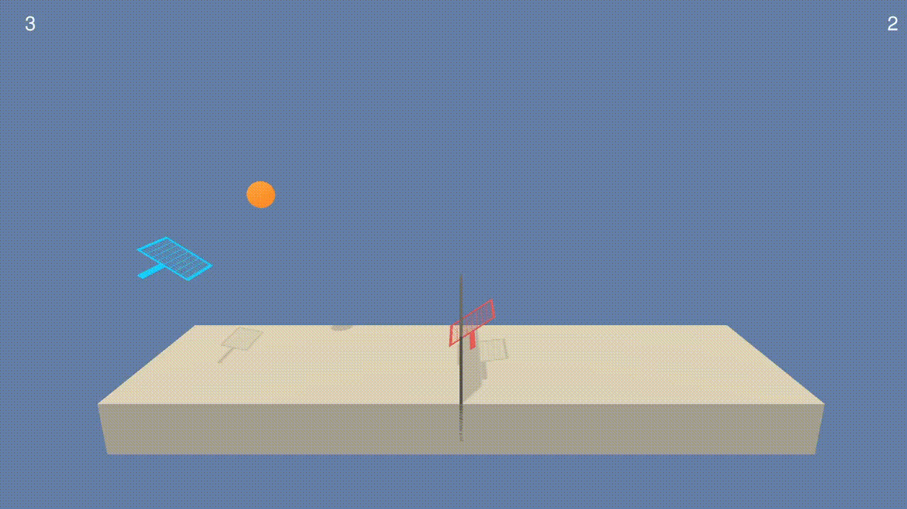
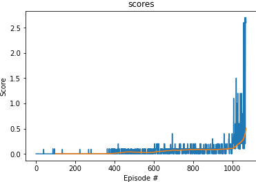

# Project 2: Continous Control

## Introduction
The second environment is used for training and demonstration.

## Learning algorithms
### Deep Deterministic Policy gradient (DDPG)
I used the DDPG from ddpg-pendulum.
The core idea of DDPG is : 
- An Actor network to approximate the optimal policy.
- A Critic network to approximate the state-action value function.

### hyper-parameters
Theses hyper-parameters are used for DDPG.

| hyper-parameters        | Value           | 
| ------------- | -------------| 
| BUFFER_SIZE      | 1000000 | 
| BATCH_SIZE      | 256 | 
| discount factor      | 0.99      |   
| TAU for soft update of target parameters| 1e-3    |   
| learning rate actor | 1e-4    |   
| learning rate critic | 1e-3    |   
| WEIGHT_DECAY | 0    |  
| NOISE_SIGMA | 0.4    |  

### Neural work architecture
The neutral network has the same architecture as it of DQN except the last layer. 
Actor network architecture is:
- Input layer size: 24
- Hidden layer 1 size: 64
- Hidden layer 2 size: 64
- Output layer size: 4

Critic network architecture is:
- Input layer size: 24
- Hidden layer 1 size: 64
- Hidden layer 2 size: 64
- Output layer size: 1

### Implementation tricks
1. Start from small network. The input state size and output action size is small.
2. Before I trained 6000 episodes with  strong noises, but the average score strongly oscillated and did not apparently increase. Then I tried to cancel noises after collecting sufficient experiences (especially those with positive rewards). 
This enables exploitation of the policy instead of exploration. 
However, the agent cannot learn techniques dealing with special scenarios.
3. Large buffer size to save those positive experience.

## Experiment results
DDPG solved the environment in **971** episodes with average Score: 0.51.

## Ideas for Future Work
At the beginning of training, it is really difficult for the agent get some rewards. Prioritized experience replay might be helpful.

It will be interesting  to try MADPPG in the environment.

## References
### Paper
- [DDPG](https://arxiv.org/abs/1509.02971)

